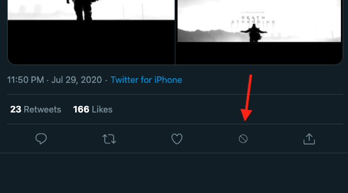

# Nuker

Nuker is an easy way to nuke your tweet.

To install, download and unzip the file into a directory. Then go to Chrome>>Settings>>More Tools>>Extension. Turn on Developer Mode on the top right hand corner, than push "Load Unpacked". Open the directory with the extension in it. You are set! Have fun.

The source code is open so everyone can see and make changes. The extension does not connect to the Internet.

# How to use:
1. Install the extension, see above.
2. Click on the tweet you would like to nuke.
3. Click on the block icon in the toolbar
 

4. Confirm and watch the mushroom cloud
